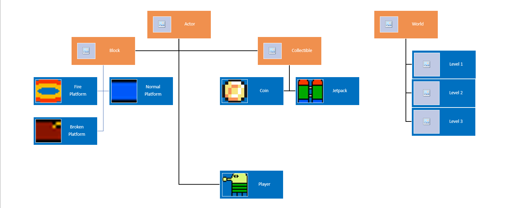

# README #
**Game Title:** Doodle Jump

## Game Proposal for Doodle Jump ##

Doodle Jump(similar to No Leg Lenny), is a game in which the player is must make there way up the map by landing on platforms that accelerate the player upwards. As the player moves upward so does the screen, however if the player were to fall below the screen it would result in an immediate game over. Hence the screen does not move down, so failure to land on a platform would result in a game over in most cases. There will also be different kinds of platforms like "fire platforms", "breakable platforms" "moving platforms" and "normal platforms". There will also be obstacles like tanks that shoot the occasional bullets, if hit, it will result in an immediate game over. We are also adding some game mechanics from no leg lenny.   

Game Controls:

+Mouse right-click: Propels the player in the opposite direction 

Game Elements:

+ Character moves in the opposite direction of the mouse click.

+ Obstacles:
	+ Normal Platforms, which the player can land on and will be propelled upwards.  
	+ Fire Platforms, which if the player lands on will result in an immediate game over. 
	+ Breakable Platforms, which will break as soon as the character lands on them, meaning the player can land on this platform again.  
	+ Turrets, which shoot bullets from time to time. If hit, it will result in an immediate game over.
	
+ Game is over when the player fails to land on a platform and fall below the screen. 

How to Win:
+ Player must collect as many coins as possible, and the map/level is endless. 

## Link Examples ##

+ https://htmlgames.github.io/htmlgames/differences/jump/index.html (online game of Doodle Jump)

## Class Design and Brainstorm ##

